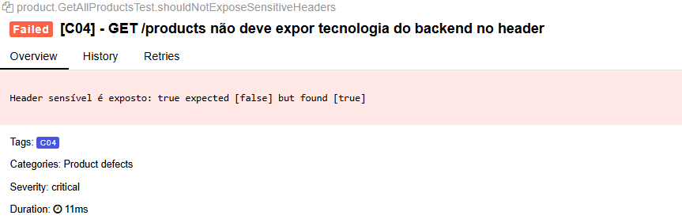
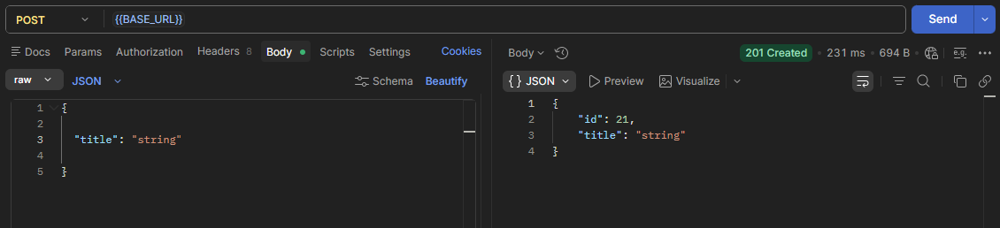
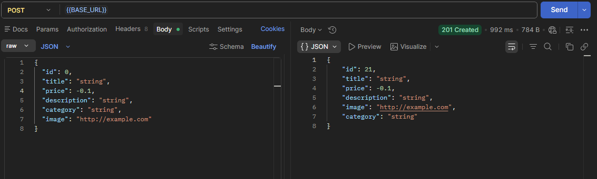
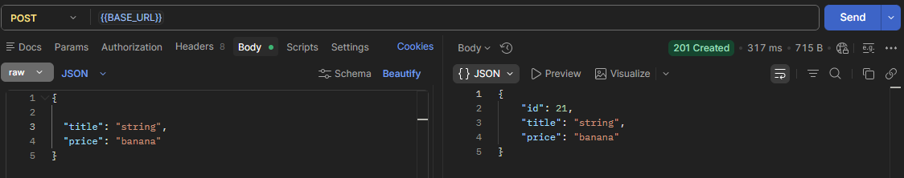

# Testes de API - Fake Store API

## GET /products
**Endpoint:** `https://fakestoreapi.com/products`
**Objetivo:** garantir que o endpoint mantém o contrato, integridade dos dados e comportamentos esperados

### Resposta esperada
Status `200` com um array contendo 20 objetos de produto, seguindo o schema observado:

- `id`: Integer
- `title`: String
- `price`: Float
- `description`: String
- `category`: String
- `image`: String (URI)
- `rating`: Object
  - `rate`: Float
  - `count`: Integer

---

## Cenários de Teste
| ID | Cenário | Validações | Status |
|----|---------|-----------|--------|
| C01 | Validar status e estrutura básica | • Status `200` • Response é um array • Array não vazio (sempre 20 produtos) | PASS |
| C02 | Validar schema dos produtos | Para cada item do array: • `id`: Integer • `title`: String • `price`: Float • `description`: String • `category`: String • `image`: String (URI) • `rating.rate`: Float • `rating.count`: Integer | PASS |
| C03 | Validar unicidade de IDs | Extrair todos os `id` e garantir que não há duplicatas na listagem | PASS |
| C04 | Validar headers da resposta | • `Content-Type: application/json` (A)  • Verificar vazamento de dados sensíveis nos headers (B) •  |  A- PASS   B- FAIL +  Documentado no Relatório |
| C05 | Validar parâmetro `limit` | • Retorno deve ser igual ao valor de `limit` enviado • Limites válidos: `1` a `20`(A)    • Limites inválidos: `0`, `-1`, `abc` (B) | A - PASS + B - PASS + Documentado no Relatório |
| C06 | Validar ordenação (`sort=asc`/`desc`) | Validar se a resposta está ordenada por `id` conforme o parâmetro enviado | PASS |

---

## GET /products/{id}
**Endpoint:** `https://fakestoreapi.com/products`

### Resposta esperada
Status `200` com objeto de id equivalente ao solicitado contendo no body o produto encontrado, seguindo o schema observado:

- `id`: Integer
- `title`: String
- `price`: Float
- `description`: String
- `category`: String
- `image`: String (URI)
- `rating`: Object
  - `rate`: Float
  - `count`: Integer

---
## POST /products
**Endpoint:** `https://fakestoreapi.com/products`

### Resposta esperada
Status `201` contendo no body o produto equivalente ao criado, seguindo o schema observado:

- `id`: Integer
- `title`: String
- `price`: Float
- `description`: String
- `category`: String
- `image`: String (URI)

## Cenários de Teste
| ID | Cenário | Validações | Status |
|----|---------|-----------|--------|
| C12 | Produto criado com sucesso  | • Status `200` • Response body com objeto produto igual ao enviado | PASS |
| C13 | Schema da resposta está correto(campos obrigatórios e tipos corretos) |schema: • `id`: Integer • `title`: String • `price`: Float • `description`: String • `category`: String • `image`: String (URI)  | PASS |
| C14 | Body do request com payload parcial/vazio|• Status `200`   • Response body com id    • Response body com objeto produto igual ao enviado | PASS |
| C15 |Body do request com JSON mal formado | • 400 - Bad request  • Retorna HTML de erro | PASS |
| C16 |Body do request com tipos de dados incorretos  |  • Entrada:`2147483648`,`99999999999`,`-2147483648`  • 200 - OK    | - |
| C17 |Body do request testando limite dos campos do payload  | • Status `200`   • Response body com id    • Response body com objeto produto igual ao enviado | - |
| C18 *|Deve verificar o body do request com risco de Dos  | • Status `413`   • Response body com id    • Response body com erro em HTML | PASS |

* **Obs:** [Segurança em aplicação em Node](https://medium.com/@vloban/common-security-issues-in-node-js-applications-51d334d42223)

---
## Cenários de Teste

| ID | Cenário | Validações | Status |
|----|---------|-----------|--------|
| C19 | Atualização de produto com sucesso | • Status `200`  • Response body com objeto produto atualizado igual ao enviado  • Campos alterados persistem corretamente | - |
| C20 | Schema da resposta está correto (campos obrigatórios e tipos corretos) | schema: • `id`: Integer • `title`: String • `price`: Float • `description`: String • `category`: String • `image`: String (URI) | - |
| C21 | Atualização de produto com payload parcial/vazio | • Status `200`  • API aceita atualização parcial ou mantém valores anteriores (conforme regra do endpoint) • Response body contém estrutura válida | - |
| C22 | Atualização de produto inexistente | • Enviar `id` que não existe • Status esperado `404 - Not Found` ou comportamento definido pela API • Response body contém mensagem de erro válida | - |
| C23 | Body do request com JSON mal formado | • Status `400 - Bad Request`  • Response body contém erro de validação/formatação • Não deve atualizar o produto | - |
| C24 | Body do request com tipos de dados incorretos | • Entrada: `id`: String `price`: String/Boolean `title`: Integer • Status esperado `400 - Bad Request` ou erro de validação • Produto não deve ser alterado | - |
| C25 | Body do request testando limite dos campos do payload | • Enviar valores máximos/mínimos: • `title` e `description` com tamanho máximo permitido • `price` com valores limite • Status esperado conforme regra da API • Response body mantém contrato esperado | - |
| C26 | Atualização utilizando campos extras não esperados | • Enviar campos adicionais no JSON • API deve ignorar campos extras ou retornar erro conforme contrato • Não deve comprometer a atualização | - |
| C27 | Atualização com caracteres especiais no payload | • Enviar caracteres Unicode, emojis e símbolos em campos texto • Status `200` ou erro controlado • Dados armazenados corretamente sem quebra de encoding | - |
| C28 | Atualização com payload muito grande (risco de DoS) | • Enviar body acima do limite esperado • Status esperado `413 - Payload Too Large` • Response body contém erro controlado • API permanece disponível | - |

---

## Achados do Relatório de Testes

### Schema do response não documentado corretamente

O schema documentado para `GET /products` e `GET /products/{id}` **não inclui** o campo `rating`, mas a resposta real sempre retorna esse objeto aninhado (`rating.rate`, `rating.count`).

**Impacto:** Pode causar quebra de contrato para consumidores que fazem validação estrita de schema (schema validation) baseada apenas na documentação oficial.

| | Documentado | Retorno real |
|---|---|---|
| GET /products | *(sem campo `rating`)* | Inclui `rating: { rate, count }` |
| GET /products/{id} | *(sem campo `rating`)* | Inclui `rating: { rate, count }` |

---

### Parâmetro `limit` sem validação de entrada

A API **não trata valores inválidos de `limit` com status code apropriado (`400 Bad Request`)**. Todos os cenários abaixo retornam `200 OK`, mesmo com valores fora do domínio esperado:

| Valor enviado | Status Code | Itens retornados | Comportamento observado |
|---|---|---|---|
| `limit=0` | 200 | 20 | Parâmetro ignorado — retorna todos os produtos |
| `limit=-1` | 200 | 19 | Valor negativo aplicado literalmente (comportamento tipo `slice(0, -1)`) |
| `limit=abc` | 200 | 20 | Parâmetro não numérico ignorado — retorna valor padrão |

---

### Vazamento de informação via header X-Powered-By

O teste do cenário 04 está falhando porque o endpoint retorna header `X-Powered-By: Express`, expondo publicamente a tecnologia utilizada no backend (Express). Essa prática é desencorajada por boas práticas de segurança (OWASP), pois facilita a um atacante direcionar ataques específicos para vulnerabilidades conhecidas da stack identificada.

| | Documentado | Retorno real |
|---|---|---|
| GET /products | *(sem exposição de tecnologia)* | Header `X-Powered-By: Express` presente |

---

### GET / products/{id} retorna status code 200 para IDs inválidos e inexistentes
O teste do cenário CO10 e C011 para `GET /products/{id}` retorna `HTTP 200 OK` quando recebe um ID inválido. 

Para uma requisição com identificador inexistente ou inválido, o comportamento esperado seria retornar um status code indicando que o recurso não foi encontrado ou que a requisição é inválida, como `404 Not Found`(inexistente = `50`) ou `400 Bad Request`( inválido = `abc`, `-1`, ` 1`), dependendo da regra definida pela API.

O retorno atual com `200 OK` gera ambiguidade, pois indica sucesso na operação mesmo quando nenhum produto foi localizado, dificultando o tratamento correto do cenário pelo consumidor da API.

---

### POST / products não valida campos
O teste do cenário de criação de produtos om payload parcial retorna `HTTP 201 CREATED`, mesmo quando campos obrigatórios documentados não são enviados no corpo da requisição.
De acordo com a documentação o paylload esperado deve conter os seguintes campos:
{ 
  "id": 0, 
  "title": "string", 
  "price": 0.1, 
  "description": "string", 
  "category": "string", 
  "image": "http://example.com" 
}

Porém ao enviar payload vazio ou com ausência desses campos, a API ainda assim processa a requisição com sucesso e gera um `id` para o recurso.
Para esse tipo de requisições, o comportamento esperado seria retornar um status code que indique erro de validação como `400 Bad Request`, evitando a criação de recursos inconsistentes e não validados.

Outro problema encontrado foi no campo `price`, que aceita números negativoa sem qualquer validação e até tipos incorretos, como string.

---