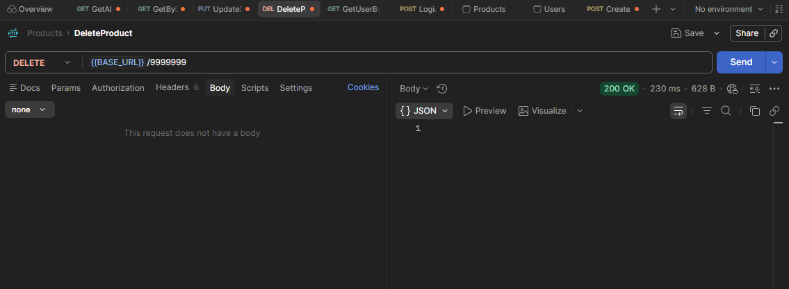
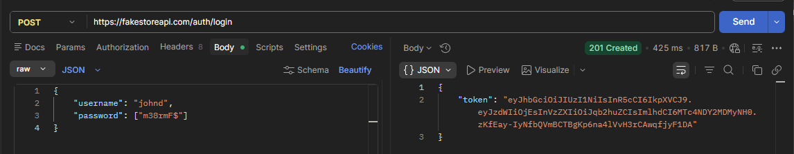
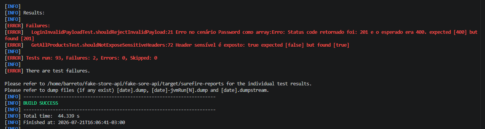

# Testes de API - Fake Store API
Fake Store API é um mock e não persiste dados de verdade.
## GET /products
**Endpoint:** `https://fakestoreapi.com/products`
**Objetivo:** garantir que o endpoint mantém o contrato, integridade dos dados e comportamentos esperados

### Resposta esperada
Status `200` com um array contendo 20 objetos de produto, seguindo o schema observado:

- `id`: Integer
- `title`: String
- `price`: Float
- `description`: String
- `category`: String
- `image`: String (URI)
- `rating`: Object
  - `rate`: Float
  - `count`: Integer

---

## Cenários de Teste
| ID | Cenário | Validações | Status |
|----|---------|-----------|--------|
| C01 | Validar status e estrutura básica | • Status `200` • Response é um array • Array não vazio (sempre 20 produtos) | PASS |
| C02 | Validar schema dos produtos | Para cada item do array: • `id`: Integer • `title`: String • `price`: Float • `description`: String • `category`: String • `image`: String (URI) • `rating.rate`: Float • `rating.count`: Integer | PASS |
| C03 | Validar unicidade de IDs | Extrair todos os `id` e garantir que não há duplicatas na listagem | PASS |
| C04 | Validar headers da resposta | • `Content-Type: application/json` (A)  • Verificar vazamento de dados sensíveis nos headers (B) •  |  A- PASS   B- FAIL +  Documentado no Relatório |
| C05 | Validar parâmetro `limit` | • Retorno deve ser igual ao valor de `limit` enviado • Limites válidos: `1` a `20`(A)    • Limites inválidos: `0`, `-1`, `abc` (B) | A - PASS + B - PASS + Documentado no Relatório |
| C06 | Validar ordenação (`sort=asc`/`desc`) | Validar se a resposta está ordenada por `id` conforme o parâmetro enviado | PASS |

---

## GET /products/{id}
**Endpoint:** `https://fakestoreapi.com/products/{id}`

### Resposta esperada
Status `200` com objeto de id equivalente ao solicitado contendo no body o produto encontrado, seguindo o schema observado:

- `id`: Integer
- `title`: String
- `price`: Float
- `description`: String
- `category`: String
- `image`: String (URI)
- `rating`: Object
  - `rate`: Float
  - `count`: Integer

---
## POST /products
**Endpoint:** `https://fakestoreapi.com/products`

### Resposta esperada
Status `201` contendo no body o produto equivalente ao criado, seguindo o schema observado:

- `id`: Integer
- `title`: String
- `price`: Float
- `description`: String
- `category`: String
- `image`: String (URI)

## Cenários de Teste
| ID | Cenário | Validações | Status |
|----|---------|-----------|--------|
| C12 | Produto criado com sucesso  | • Status `201` • Response body com objeto produto igual ao enviado | PASS |
| C13 | Schema da resposta está correto(campos obrigatórios e tipos corretos) |schema: • `id`: Integer • `title`: String • `price`: Float • `description`: String • `category`: String • `image`: String (URI)  | PASS |
| C14 | Body do request com payload parcial/vazio|• Status `200`   • Response body com id    • Response body com objeto produto igual ao enviado | PASS |
| C15 |Body do request com JSON mal formado | • 400 - Bad request  • Retorna HTML de erro | PASS |
| C16 |Body do request com tipos de dados incorretos  |  • Entrada:`2147483648`,`99999999999`,`-2147483648`  • 200 - OK    | - |
| C17 |Body do request testando limite dos campos do payload  | • Status `200`   • Response body com id    • Response body com objeto produto igual ao enviado | - |
| C18 *|Deve verificar o body do request com risco de Dos  | • Status `413`   • Response body com id    • Response body com erro em HTML | PASS |

* **Obs:** [Segurança em aplicação em Node](https://medium.com/@vloban/common-security-issues-in-node-js-applications-51d334d42223)

---

## PUT /products/{id}
**Endpoint:** `https://fakestoreapi.com/products/{id}`

### Resposta esperada
Status `200` contendo no body o produto equivalente ao atualizado, seguindo o schema observado:

- `id`: Integer
- `title`: String
- `price`: Float
- `description`: String
- `category`: String
- `image`: String (URI)

## Cenários de Teste

| ID | Cenário | Validações | Status |
|----|---------|-----------|--------|
| C19 | Atualização de produto com sucesso | • Status `200`  • Response body com objeto produto atualizado igual ao enviado  • Campos alterados persistem corretamente | PASS |
| C20 | Schema da resposta está correto (campos obrigatórios e tipos corretos) | schema: • `id`: Integer • `title`: String • `price`: Float • `description`: String • `category`: String • `image`: String (URI) | PASS |
| C21 | Atualização de produto com payload parcial/vazio | • Status `200`  • API aceita atualização parcial ou mantém valores anteriores (conforme regra do endpoint) • Response body contém estrutura válida | PASS |
| C22 | Atualização de produto inexistente | • Enviar `id` que não existe • Status esperado `200`  (comportamento definido pela API) • Response body contém id e dados de atualização enviados | PASS |
| C23 | Body do request com JSON mal formado | • Status `400 - Bad Request`  • Response body contém erro de validação/formatação • Não deve atualizar o produto | PASS |
| C24 | Body do request com tipos de dados incorretos | • Entrada: `id`: String `price`: String/Boolean `title`: Integer • Status esperado `200` (comportamento Response body contém id e dados de atualização enviados)| - |
| C25 | Body do request testando limite dos campos do payload | • Enviar valores máximos/mínimos: • `title` e `description` com tamanho máximo permitido • `price` com valores limite • Status esperado conforme regra da API • Response body mantém contrato esperado | - |
| C26 | Atualização utilizando campos extras não esperados | • Enviar campos adicionais no JSON • API deve ignorar campos extras • Não deve comprometer a atualização(comportamento da API) | PASS |
| C27 | Atualização com payload muito grande (risco de DoS) | • Enviar body acima do limite esperado • Status esperado `413 - Payload Too Large` • Response body contém erro •  Envia html de erro | PASS |

---

## DELETE /products/{id}
**Endpoint:** `https://fakestoreapi.com/products/{id}`

### Resposta esperada
Status `200` contendo no body o produto equivalente ao deletado, seguindo o schema observado:

- `id`: Integer
- `title`: String
- `price`: Float
- `description`: String
- `category`: String
- `image`: String (URI)

## Cenários de Teste

| ID | Cenário | Status |
|----|---------|--------|
| C28 | Deleção de produto com `id` válido | PASS |
| C29 | Deleção de produto com `id` inválido | PASS |
| C30 | Schema da resposta está correto (campos obrigatórios e tipos corretos) | PASS |
| C31 | Deleção enviando body no request | PASS |
| C32 | Deleção sem informar o `id` no path param | PASS |

---

## POST /auth/login
**Endpoint:** `https://fakestoreapi.com/auth/login`

### Resposta esperada
Login com credenciais válidas deve retornar um token de autenticação no body:
- `token`: String (JWT)

### Cenários de Teste 

| ID | Cenário | Status |
|----|---------|--------|
|C35 |Corpo da requisição como credenciais válidas| PASS |
|C36 |Corpo da requisição como payload inválido| PASS ** |
|C37 |Corpo da requisição como credenciais inválidas| PASS |

** Obs: Existe um cenário que não retornou 400 (C36: "Password como array"), API responde como `201`.

---

# Achados do Relatório de Testes

## 1. Contrato de resposta inconsistente entre documentação e endpoints

A API apresenta divergências entre o schema documentado e o comportamento real dos endpoints.

O campo `rating` não está documentado nos schemas de resposta de:

- `GET /products`
- `GET /products/{id}`

Porém, esse campo é retornado pela API:

{
  "rating": 
  {
    "rate": 4.5,
    "count": 120
  }
}

| Endpoint              | Retorna `rating` |
| --------------------- | ---------------- |
| GET /products         |   Sim            |
| GET /products/{id}    |   Sim            |
| POST /products        |   Não            |
| PUT /products/{id}    |   Não            |
| DELETE /products/{id} |   Não            |

**Impacto:** A inconsistência pode causar quebra de contrato para consumidores que utilizam validação de schema ou esperam um formato uniforme entre operações.

**Obs:** Os testes realizados para o GET levaram em consideração o campo rating no schema.

---

## 2. Endpoints POST e PUT não validam campos obrigatórios do payload

Os endpoints de criação e atualização de produtos aceitam requisições com payload vazio ou incompleto, mesmo quando campos obrigatórios estão definidos na documentação.

Endpoints afetados:
`POST /products`
`PUT /products/{id}`

* Payload esperado:

{
  "id": 0,
  "title": "string",
  "price": 0.1,
  "description": "string",
  "category": "string",
  "image": "http://example.com"
}

Ao enviar payload parcial ou vazio a API retorna sucesso(201 - POST e 200 - PUT), informando ao cliente que processou a operação normalmente. 

**Impacto:** a criação ou atualização sem os campos obrigatórios podem causas inconsistência nos dados. Seria correto a API validar o payload e retornar  `400 BAD REQUEST`

---

## 3. Campo price em PUT E POST aceita valores inválidos

O campo price não possui validação adequada nos endpoints de criação e atualização de produtos.

Foram identificados os seguintes comportamentos:
* Aceita valores negativos
{
  "price": -10
}

* Aceita tipos incompatíveis:
{
  "price": "valor inválido"
}

A API deve validar o tipo de campo, valores permitidos e retornar `400 BAD REQUEST` para dados inválidos com mensagem específica para o campo que tem contém o dado errado.

Não valida valores negativos para campo price

Não valida tipo de dado enviado para campo price

---

## 4. Endpoints não validam existência do recurso informado pelo ID
Os endpoints abaixo não verificam corretamente se o produto informado existe:

* GET /products/{id} -  retorna `200 OK` com corpo vazio
* PUT /products/{id} - retorna `200 OK` com os dados atualizados presentes na requisição
* DELETE /products/{id} - retorna `200 OK` com corpo vazio

A validação evita operações inconsistentes e facilita o tratamento de erros pelos clientes da API.

---

## 5. Parâmetro `limit` sem validação de entrada

A API **não trata valores inválidos de `limit` com status code apropriado (`400 Bad Request`)**. Todos os cenários abaixo retornam `200 OK`, mesmo com valores fora do domínio esperado:

Valores inválidos deveriam retornar mensagem de erro específica para o problema relacionado ao campo e status code `400 BAD REQUEST`

| Valor enviado | Status Code | Itens retornados | Comportamento observado |
|---|---|---|---|
| `limit=0` | 200 | 20 | Parâmetro ignorado — retorna todos os produtos |
| `limit=-1` | 200 | 19 | Valor negativo aplicado literalmente (comportamento tipo `slice(0, -1)`) |
| `limit=abc` | 200 | 20 | Parâmetro não numérico ignorado — retorna valor padrão |

---

## 6. Vazamento de informação via header X-Powered-By

O teste do cenário 04 está falhando porque o endpoint retorna header `X-Powered-By: Express`, expondo publicamente a tecnologia utilizada no backend (Express). Essa prática é desencorajada por boas práticas de segurança (OWASP), pois facilita a um atacante direcionar ataques específicos para vulnerabilidades conhecidas da stack identificada.

---

## 7. Password aceita array e retorna `201 Created` como se fosse um login válido

O endpoint `POST /auth` não valida o **tipo** do campo `password`. Ao enviar `password`(C36) como um array (`["m38rmF$"]`), em vez de uma `String`, a API responde `201 Created` — o mesmo status de um login bem-sucedido — em vez de rejeitar a requisição.

## Resumo - Testes com falhas conhecidas
Atualmente existem dois testes que falham propositalmente, porque documentam um comportamento real da API que diverge do esperado. Não são bugs no código dos testes, mas sim defeitos da aplicação.

C04 - Get /products - Header X Powered-By - presente
C36 - POST auth/login - Cenário com password enviado como array

